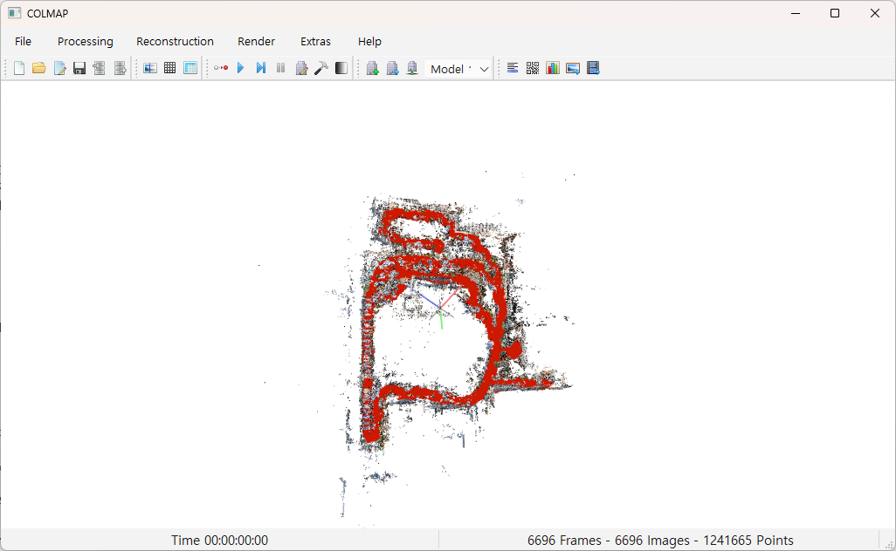
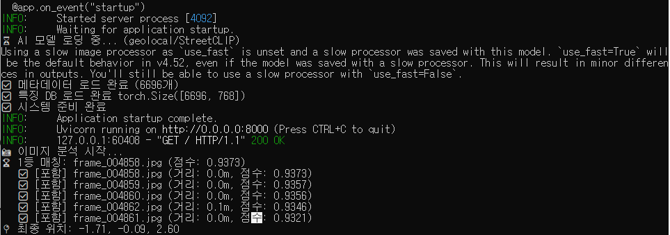

# 2025 우정광 바이브 코딩 프로젝트: 사진을 통한 신구대학교 캠퍼스 위치 탐색

## 1. 프로젝트 개요 (Project Overview)

### 프로젝트 배경 및 목적

본 프로젝트는 신구대학교 캠퍼스 공간을 대상으로 COLMAP 기반의 고정밀 3D 맵을 구축하고, StreetCLIP 딥러닝 모델을 활용하여 사용자가 촬영한 사진과 3D 맵을 매칭하는 시스템을 개발하는 것을 목표로 한다. 이를 통해 GPS 신호 수신이 불가능한 지하 공간이나 복잡한 실내에서도 사진 한 장으로 현재 위치를 정확히 파악할 수 있는 시각적 위치 추정(Visual Localization) 솔루션을 제공하고자 한다.

### 핵심 목표

| 목표 | 설명 |
|:----|:----|
| **3D 공간 데이터 구축** | 신구대학교 주요 구역의 영상 데이터를 수집하고, COLMAP을 활용하여 정밀한 3차원 포인트 클라우드 지도를 구축한다. |
| **시각적 위치 검색** | StreetCLIP 모델을 도입하여, 사용자가 촬영한 2D 쿼리 이미지를 3D 지도 상의 가장 유사한 위치와 매칭하는 AI 검색 엔진을 개발한다. |
| **사용자 친화적 시각화** | 추정된 위치를 학교 평면도 위에 직관적으로 표시하여 사용자가 자신의 위치를 쉽게 파악할 수 있도록 한다. |

위 세 가지를 목표로 삼아 사진 한 장으로 위치를 간단히 파악할 수 있도록 한다.

## 2. 기술 스택

| 주요 라이브러리 | 설명 |
|:----|:----|
| **torch** | 고속 행렬 연산(유사도 계산 torch.mm) 및 딥러닝 모델 실행에 사용되었다 |
| **transformers** | 고속 행렬 연산(유사도 계산 torch.mm) 및 딥러닝 모델 실행에 사용되었다 |
| **fastapi** | 이미지를 업로드받고 결과를 JSON으로 돌려주는 웹 프레임워크 |
| **uvicorn** | FastAPI를 실행시켜 주는 고성능 ASGI 서버 |
| **pandas** | image_metadata_with_6dof.csv 파일(위치 정보)을 읽고 다루는 데 사용되었다 |
| **numpy** | .npy 파일(특징점 DB)을 로딩하고 숫자를 다루는 데 사용되었다 |
| **Pillow** | 업로드된 이미지 파일을 열고(Image.open) 모델에 넣을 수 있게 변환하는 데 사용되었다 |
| **Three.js** | 웹 브라우저에서 3D 공간을 만들고, 지도와 포인트 클라우드, 빨간 점(내 위치)을 그리는 핵심 엔진 |
위 라이브러리들을 활용하여 진행하였다.

## 3. 개발 과정

### 데이터 수집 및 전처리

신구대학교 정문, 본관, 동관 등 주요 경로를 따라 55분 가량의 1개의 영상을 촬영했다. 특히 COLMAP의 복원율을 높이기 위해 천천히 걷기, 다양한 각도 촬영, 왕복 촬영(Loop Closure) 전략을 적용했다. 해당 영상을 0.5초 간격으로 영상을 프레임화하여 총 6000장 이상의 학습용 이미지 데이터셋을 구축했다.

### 3D 구축

COLMAP으로 영상에서 추출한 수천 장의 프레임을 분석하여 카메라의 6자유도(6-DOF) 위치와 3차원 구조를 복원하였다. 다음은 실행 코드에 대한 간단한 설명이다.

``` 
    # 1. 특징점 추출 (Feature Extraction)
    # ⭐️ 수정: --SiftMatching.max_ratio 0.7 옵션을 이 단계에서 제거
    cmd_fe = (
        f'"{COLMAP_EXE_PATH}" feature_extractor '
        f'--database_path "{DATABASE_PATH}" '
        f'--image_path "{BASE_IMAGE_DIR}" '
        f'--ImageReader.single_camera 1 ' 
        f'--ImageReader.camera_model SIMPLE_RADIAL ' 
        f'--SiftExtraction.use_gpu 1 '
        f'--SiftExtraction.max_num_features {MAX_NUM_FEATURES} '
    )
    if not run_colmap_command(cmd_fe, "특징점 추출 및 설정"): return False
```
| 주요 설정 | 설명 |
|:----|:----|
| **--ImageReader.single_camera 1** | 카메라가 1개로 촬영되었다는 것(영상 내내 초점거리(Zoom)와 렌즈 세팅이 변하지 않았다)을 설정 |
| **--ImageReader.camera_model SIMPLE_RADIAL** | 굴곡이 있는 렌즈로 촬영했다는 설정. 휴대전화 카메라로 촬영되었음 |
| **--SiftExtraction.max_num_features {MAX_NUM_FEATURES}** | 사진 한 장당 특징점 발견 최대 제한. 메모리 관계상 6000개로 제한 |

```
    # 2. 특징점 매칭 (Sequential Matcher 적용)
    # ⭐️ 수정: --SiftMatching.max_ratio 0.7 옵션을 이 단계로 이동
    cmd_sm = (
        f'"{COLMAP_EXE_PATH}" sequential_matcher '
        f'--database_path "{DATABASE_PATH}" '
        f'--SequentialMatching.overlap {OVERLAP_COUNT} ' 
        f'--SequentialMatching.loop_detection 1 ' 
        f'--SequentialMatching.loop_detection_period {LOOP_DETECTION_PERIOD} '
        f'--SiftMatching.use_gpu 1 '
        f'--SiftMatching.num_threads {os.cpu_count()} '
        f'--SiftMatching.max_ratio 0.8'  # ⭐️ 수정: 매칭 엄격도 강화 옵션 추가
    )
    if not run_colmap_command(cmd_sm, "특징점 매칭 (Sequential Matcher)"): return False
```
| 주요 설정 | 설명 |
|:----|:----|
| **{COLMAP_EXE_PATH}" sequential_matcher** | 시퀀스 매칭, 사진들이 동영상처럼 순서대로(Filename 순) 찍혔다는 것을 전제로 하여 매칭 속도와 정확도를 높이는 방식 |
| **--SequentialMatching.overlap {OVERLAP_COUNT}** | 앞뒤 사진 매칭 제한, 메모리상 20장으로 제한 |
| **--SequentialMatching.loop_detection 1** | 루프 감지, 왕복하였기 때문에 제자리로 왔는지를 감지 |
| **--SequentialMatching.loop_detection_period {LOOP_DETECTION_PERIOD}** | 루프 감지 제한, 50프레임마다 루프 감지 시도 |
| **--SiftMatching.max_ratio 0.8** | 매칭의 엄격함의 정도, 기본값이 0.8 |
```
    # 3. 구조 복원 (Mapper)
    cmd_map = (
        f'"{COLMAP_EXE_PATH}" mapper '
        f'--database_path "{DATABASE_PATH}" '
        f'--image_path "{BASE_IMAGE_DIR}" '
        f'--output_path "{SPARSE_OUTPUT_DIR}" '
        f'--Mapper.min_num_matches 25 ' 
        f'--Mapper.num_threads {os.cpu_count()}' 
    )
    if not run_colmap_command(cmd_map, "구조 복원 (Mapper)"): return False
```

| 주요 설정 | 설명 |
|:----|:----|
| **--Mapper.min_num_matches 25** | 두 사진 사이의Match가 최소 25개는 되어야 유효한 연결로 인정하겠다는 설정, 기본값 15 |
| **--Mapper.num_threads {os.cpu_count()}** | 모든 CPU 코어를 사용하여 속도를 최대한 끌어올리라는 설정, 사용 버전에는 gpu 설정이 없음 |


해당 설정들을 통해 약 12시간의 실행 후 3D 맵이 완성되었다.

### 위치 추정 알고리즘 구현

본 프로젝트에서는 시각적 위치 추정(Visual Localization)의 강건성을 확보하기 위해 StreetCLIP 모델을 활용하였다. StreetCLIP은 기존 CLIP 모델을 도시 환경 데이터셋으로 미세 조정(Fine-tuning)하여, 조명 변화나 계절적 차이와 같은 환경 변수에 강한 특성을 가진다. 우리는 COLMAP을 통해 복원된 3D 맵을 구성하는 모든 키프레임(Keyframe) 이미지에 대해 StreetCLIP 인코더를 통과시켜 **768차원의 고차원 특징 벡터(Feature Vector)**를 추출하였다. 추출된 벡터들은 정규화(L2 Normalization) 과정을 거쳐 데이터베이스화되었으며, 이는 추후 사용자 입력 이미지와의 코사인 유사도(Cosine Similarity) 계산을 위한 기준 데이터로 활용된다.

### fastAPI를 통한 구현
COLMAP이 생성한 원본 3D 데이터(points3D.bin)를 웹 브라우저(Three.js)가 쉽게 읽을 수 있고, 로딩 속도도 빠르도록 가볍게 변환하여 사용하였다. uvicorn을 이용한 서버 구축을 하여 fastAPI를 사용해 StreetCLIP의 예측 결과를 웹에 띄웠다.



## 4. 프로젝트 결과 및 성과 (Results)

신구대학교 캠퍼스 주요 구역에 대한 고밀도 3D 포인트 클라우드 데이터를 성공적으로 생성했다.

## 5. 결론 및 향후 과제 (Conclusion)

본 프로젝트는 별도의 비콘(Beacon)이나 하드웨어 설치 없이, 오직 영상 데이터와 AI 기술만으로 캠퍼스 내 위치 추정 시스템을 구현할 수 있음을 증명했습니다. 향후 과제로는 41개 조각 맵의 자동 통합 알고리즘 고도화와 모바일 앱으로의 서비스 확장을 제안합니다. 이 시스템은 신구대학교를 넘어, 대규모 쇼핑몰이나 공항 등 다양한 실내 공간의 스마트 네비게이션 솔루션으로 확장될 잠재력을 가지고 있습니다.
